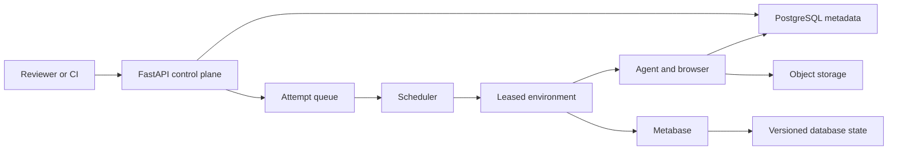

# Productionization Plan

## The main idea

The current repository is a strong local evaluation tool. FastAPI accepts an evaluation, an in-process thread pool runs attempts, Docker Compose provides one or two Metabase environments, and `runs/` stores the evidence.

To productionize it, keep the agent, task parsing, grading, evidence format, and review UI. Replace the parts that assume one machine:

| Today | Production |
| --- | --- |
| Jobs live in Python memory | Jobs and attempts live in PostgreSQL |
| Threads schedule work | A durable queue schedules work |
| One or two local environments | A pool of isolated, leased environments |
| Evidence is written to `runs/` | Evidence is uploaded to object storage |
| Local credentials in `.env` | Short-lived credentials from a secret manager |
| Local dashboard protection | SSO, roles, audit logs, and private networking |

The core rule is: **every rollout starts from known state, gets exclusive access to that state, and cannot affect another rollout.**

## Concrete production architecture

A practical AWS design would use:

- the existing FastAPI application on ECS Fargate, behind a load balancer and SSO;
- RDS PostgreSQL for evaluations, tasks, attempts, leases, grades, and artifact locations;
- SQS for pending rollout attempts;
- an autoscaled pool of ECS environment tasks;
- S3 for screenshots, traces, logs, final output, and grading evidence;
- a secret manager for model and Metabase credentials;
- CloudWatch or OpenTelemetry for logs, metrics, and alerts.

This does not need Kubernetes initially. ECS provides container isolation and autoscaling with less operational work. Kubernetes becomes reasonable if it is already a company standard or if we later need complex placement for hundreds of continuously active environments.

The control plane does not execute browsers or manage Docker directly. Its job is to validate work, persist intent, apply quotas, and enqueue attempts. The execution plane owns containers and can scale independently.

## Container and environment design

Use a few small, purpose-built images rather than one large image built for every run:

- **Control-plane image:** FastAPI and the existing UI. It has no browser, Docker socket, or access to rollout credentials.
- **Agent-runner image:** the existing Python adapter plus pinned Chromium. It uses a read-only root filesystem, an ephemeral working directory, fixed CPU/memory limits, and no host mounts.
- **Metabase image:** the pinned upstream Metabase version already used by the repository.
- **Database image/snapshot:** PostgreSQL 17 plus a reference to the immutable seeded baseline. Do not copy credentials or rollout artifacts into an image.

Pin images by digest and build them once in CI. Put slow-changing layers such as Chromium before frequently changing application code so container registries and worker nodes can reuse cached layers. A rollout should never run `apt install`, download Chromium, rebuild an image, or perform a full `pg_restore` if a clean snapshot is already available.

An **environment** is the unit of capacity. It includes a reachable Metabase instance, the required database state, and the network rules for one rollout. The disposable agent/browser container leases that environment. Each lease has an owner, heartbeat, and expiry time.

Use a clear environment lifecycle:

`provisioning -> ready -> leased -> draining -> reset -> ready`

If health checks or reset verification fail, move it to `quarantined` and destroy it. Never return an uncertain environment to the ready pool. Keep a small number ready to avoid Metabase cold-start delay; grow the pool only when the queue justifies it and shrink it when idle.

The agent container should reach only its assigned Metabase origin, the model API through a controlled egress path, and S3 for artifact upload. It should not reach the control-plane database, other environments, the container runtime, host filesystem, or cloud metadata service.

## Choose isolation by task type

Creating a full database copy for every read-only rollout is safe but wasteful. Creating no copy for write tasks is unsafe. Make isolation an explicit part of the task definition:

| Task type | Environment strategy | Cost implication |
| --- | --- | --- |
| Read-only data task | Share an immutable read-only data snapshot; lease a clean Metabase slot exclusively | Cheapest and fastest |
| Metabase write task | Share read-only business data; clone only the Metabase application state | Avoids copying the larger data set |
| Data write task | Clone the writable data state and Metabase application state | Highest isolation cost, used only when required |

Even a read-only task can create sessions, query history, or caches inside Metabase. Therefore, read environments are never shared concurrently and must pass a reset check before reuse.

For writable state, use copy-on-write database branches or storage snapshots. The baseline stays immutable and each clone stores only changed blocks. This is much faster and cheaper than restoring the complete PostgreSQL archive for every attempt.

For example, a “create a dashboard” task should clone Metabase state, give the agent a short-lived user allowed to create dashboards, then grade the database state. The grader verifies the expected dashboard and cards, confirms protected objects did not change, records a before/after diff, and destroys the clone.

A transaction is not enough isolation because a browser workflow spans many HTTP requests and commits. The reliable sequence is: **clone, run, grade, upload evidence, discard.**

## Running one rollout

1. The API validates the task file and creates one durable row per `(evaluation_id, task_id, attempt)`.
2. It classifies the required environment, model, and budget, then adds the attempt to the queue.
3. The scheduler reserves both model quota and a compatible environment. It does not start work if either is unavailable.
4. A runner claims the attempt with a time-limited lease and launches the agent container.
5. Screenshots, traces, and logs upload incrementally so a worker crash does not lose all evidence.
6. The runner grades the final output and, for write tasks, the resulting state.
7. It commits the result and artifact manifest atomically, then resets or destroys the environment.

Queue delivery is at least once, so duplicate delivery is expected. The unique attempt key prevents two workers from accepting two results. A heartbeat allows another worker to recover an expired lease. Only infrastructure failures are retried automatically. An incorrect answer remains a real failed rollout and is not silently rerun.

## Parallelism without runaway cost

Thousands of rollouts do not require thousands to run at once. The queue can hold thousands while a controlled number of environments run concurrently. A sensible initial operating range is 25–100 active environments.

The scheduler should calculate concurrency as the minimum of:

- healthy, compatible environments;
- model requests and tokens available per minute;
- the configured worker ceiling;
- the evaluation and tenant budget;
- available database and artifact-upload capacity.

This prevents adding 100 containers when the model provider can serve only 30 useful concurrent sessions. Queue work separately by environment version, isolation type, and model, while applying fair sharing so one large evaluation cannot starve smaller ones. Workers should prefetch only one attempt so they do not reserve work while waiting for an environment.

Parallelism reduces wall-clock time; it should not materially change cost per rollout. The checked-in sample averaged about 281 seconds per rollout. Therefore, 1,000 similar rollouts represent roughly 78 environment-hours whether they run at concurrency 25, 50, or 100:

| Concurrency | Theoretical batch time | Same core compute work |
| ---: | ---: | ---: |
| 25 | 3.1 hours | 78 environment-hours |
| 50 | 1.6 hours | 78 environment-hours |
| 100 | 47 minutes | 78 environment-hours |

Real batches take longer because of startup, reset, rate limits, and retries. The goal is not sub-linear compute cost—that is impossible if every rollout performs real work. The goal is **linear variable cost with a mostly flat control-plane cost**, rather than duplicating full databases, image builds, or idle machines for every rollout.

The main controls are:

- keep only a small warm pool and scale the rest toward zero;
- reuse immutable image layers and read-only baseline data;
- use copy-on-write clones for mutable state;
- give read, Metabase-write, and data-write tasks different resource profiles;
- place retryable burst work on Spot capacity;
- cap actions, runtime, tokens, and dollars per attempt;
- reduce screenshot frequency or resolution only when it does not weaken evidence or agent performance.

## Results, grading, and reproducibility

PostgreSQL is the source of truth for status; S3 holds large immutable files. Every result should record the task and prompt version, model parameters and token usage, agent and grader versions, image digests, baseline checksum, retry lineage, and artifact checksums.

The task format should also describe grading behavior. The current exact JSON comparison is useful, but `problem9` shows that some lists are unordered. Support explicit ordered lists, unordered lists, numeric tolerances, manual review, and database-state assertions. Do not make every comparison loose to fix one task.

## Security and operations

The production service should not expose the current `/runs` directory or job endpoints directly to the Internet. Put the API behind authentication and roles. Serve artifacts with short-lived, organization-scoped signed URLs.

Screenshots and traces may contain credentials or private data. Redact known secrets before upload, encrypt storage, restrict access, and apply retention rules. Audit task uploads, rollout starts, cancellations, write permissions, grader changes, and artifact access.

Track queue wait time, environment utilization, cold-start and reset time, rollout duration, token cost, artifact size, clone failures, and infrastructure errors. Keep platform failures separate from benchmark failures: a crashed browser is an invalid attempt; a valid but incorrect answer is a failed attempt.

## Back-of-the-envelope cost

The cost per rollout is:

`model usage + environment runtime + artifact storage + shared platform cost`

The sample in this repository used about 1.56 total rollout-hours and 64 MB of artifacts for 20 attempts—approximately 4.7 minutes and 3.2 MB per rollout.

For 1,000 similar rollouts:

| Cost area | Rough cost | Notes |
| --- | ---: | --- |
| Worker compute | **$10–$30** | Roughly 78 environment-hours on 2-vCPU/4-GB tasks, with startup and reset overhead |
| Model API | **About $195 in an example case** | At 100k input/image tokens and 5k output tokens per rollout using current Gemini 3.5 Flash standard rates |
| Artifact storage | **Under $1/month initially** | About 3.2 GB at the sample's artifact density; requests and retention also matter |
| Shared production services | **Roughly $200–$800/month** | API, load balancer, PostgreSQL, queue, secrets, logs, and monitoring before rollout usage |

The model is likely the largest variable cost. The current traces do not record token usage, so provider usage must be captured for every model turn before treating any estimate as reliable.

### Container capacity choices

| Option | Best fit | Tradeoff |
| --- | --- | --- |
| ECS Fargate | Bursty or uncertain demand | Simple and little idle cost, but higher unit compute cost |
| ECS on EC2 | Sustained, predictable utilization | Better bin-packing and cached images, but we manage nodes and pay for idle capacity |
| Spot capacity | Retryable overflow | Lower compute cost, but interruptions must be recorded as infrastructure errors and retried |
| Kubernetes | An organization already operating Kubernetes or requiring complex scheduling | Similar underlying compute plus cluster and operational overhead |
| Local machines | Development | Low direct bill, but not production-grade for isolation, durability, or recovery |

A sensible long-term shape is a small stable pool on normal capacity, scale-to-zero Fargate for irregular demand, and Spot for retryable bursts. Move more work to an EC2 pool only after metrics show that workers remain busy enough to offset idle and operational cost.

Pricing references: [Gemini API pricing](https://ai.google.dev/gemini-api/docs/pricing), [AWS Fargate pricing](https://aws.amazon.com/fargate/pricing/), and [Amazon S3 pricing](https://aws.amazon.com/s3/pricing/). These values are directional and should be recalculated for the selected region, model, and measured token usage.

## Final recommendation

Separate the durable control plane from the container execution plane. Build and pin images once. Queue attempts durably. Lease clean environments instead of creating an entire stack blindly for every run. Share only immutable read-only data, use copy-on-write clones for mutable state, and destroy anything that cannot be proven clean.

Scale against actual queue demand, model quota, and budget. This preserves the existing MVP while making parallel execution predictable: adding concurrency shortens batch time, but shared baselines, cached images, right-sized isolation, and autoscaling keep cost close to linear rather than allowing infrastructure overhead to multiply with rollout count.
